# Ravneet Sawhney

<div align="center">

### Full Stack Developer | MERN Stack Enthusiast | MCA Graduate 2025

Building scalable web applications, REST APIs and database-driven software solutions.

[Portfolio](https://ravneetportfolio.netlify.app) |
[GitHub](https://github.com/Ravneet-project) |
[LinkedIn](https://www.linkedin.com/in/ravneet-kaur-aa2b332a8/) |
[Email](mailto:ravneet.sawhney123@gmail.com)

</div>

---

## Developer Architecture

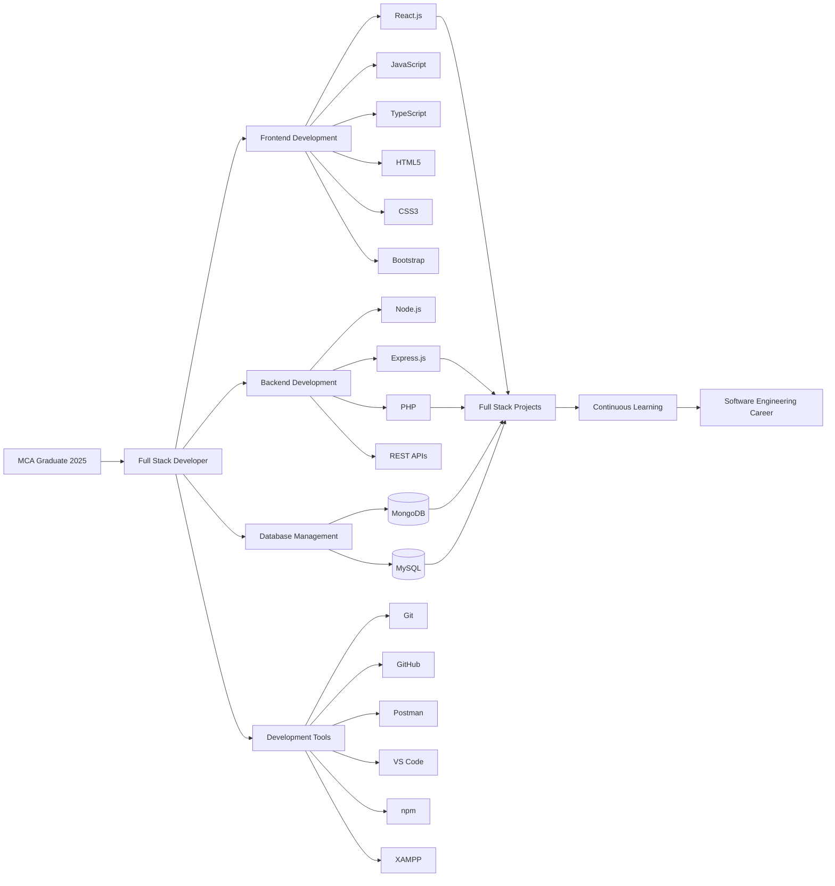

---

## About Me

I am a Full Stack Developer passionate about building scalable, user-centric and maintainable web applications.

My development experience includes frontend interfaces, backend development, REST API integration, relational and NoSQL databases, responsive design and complete project implementation.

I enjoy transforming ideas into functional software solutions while continuously improving my understanding of modern development practices, system design, data structures and application architecture.

```text
Current Role      : Full Stack Developer
Qualification     : Master of Computer Applications
Graduation Year   : 2025
Primary Focus     : MERN Stack Development
Secondary Stack   : PHP and MySQL
Career Status     : Open to Software Developer Opportunities
```

---

## Developer Class Model

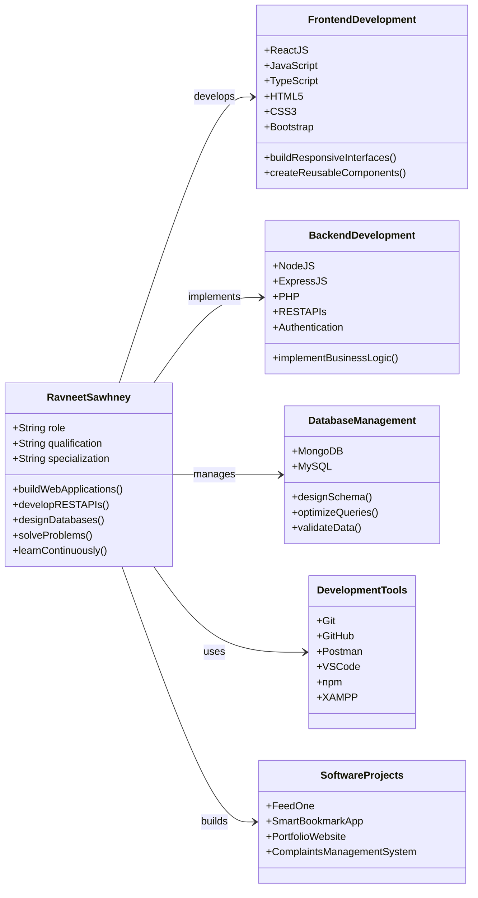

---

## Technical Skills

### Frontend Development

```text
React.js
JavaScript ES6+
TypeScript
HTML5
CSS3
Bootstrap
Responsive Web Design
Reusable Component Development
```

### Backend Development

```text
Node.js
Express.js
PHP
RESTful API Development
Server-Side Programming
Authentication and Authorization
Request Validation
Business Logic Development
```

### Databases

```text
MongoDB
MySQL
Database Design
Schema Planning
CRUD Operations
Query Optimization
Data Validation
```

### Tools and Technologies

```text
Git
GitHub
Postman
Visual Studio Code
npm
XAMPP
Vite
```

---

## Technical Capability Matrix

| Development Area | Technologies | Primary Focus |
|---|---|---|
| Frontend | React.js, JavaScript, TypeScript | Responsive and reusable interfaces |
| Backend | Node.js, Express.js, PHP | REST APIs and server-side logic |
| Database | MongoDB, MySQL | Database design and query management |
| Version Control | Git, GitHub | Repository and source-code management |
| API Testing | Postman | Endpoint testing and validation |
| Development Tools | VS Code, npm, XAMPP | Development, debugging and execution |
| Problem Solving | DSA, OOP | Logical thinking and optimized solutions |

---

## Application Architecture

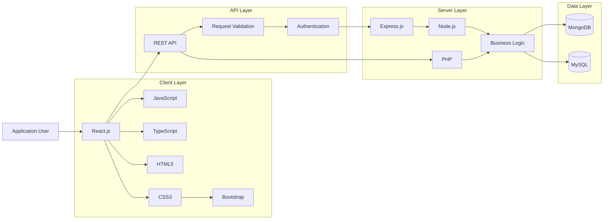

---

## Development Workflow

```mermaid
flowchart LR

    Requirement[Requirement Analysis]
    --> Research[Research]
    --> Planning[Project Planning]
    --> Design[UI and Architecture Design]
    --> Frontend[Frontend Development]
    --> Backend[Backend Development]
    --> Database[Database Integration]
    --> API[API Integration]
    --> Testing[Testing and Debugging]
    --> Deployment[Deployment]
    --> Monitoring[Monitoring]
    --> Improvement[Continuous Improvement]

    Improvement --> Requirement
```

---

## API Request Lifecycle

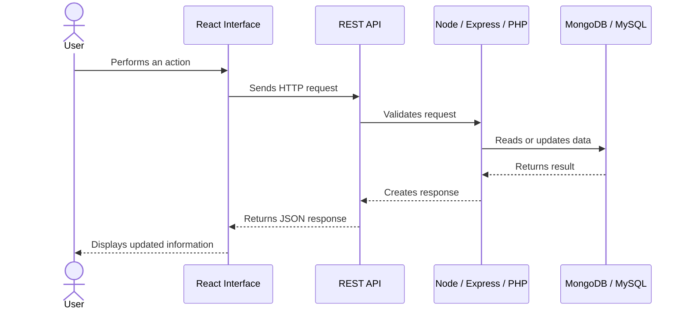

---

## Featured Projects

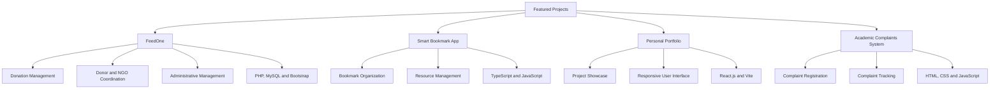

---

### FeedOne – Donation Management System

FeedOne is a web-based donation management platform designed to connect donors and NGOs through a centralized system.

The application helps simplify donation tracking, NGO coordination and administrative management.

```text
Technology Stack
├── PHP
├── MySQL
├── Bootstrap
└── JavaScript
```

---

### Smart Bookmark App

A bookmark management application developed using TypeScript to help users organize, manage and access saved web resources efficiently.

```text
Technology Stack
├── TypeScript
└── JavaScript
```

---

### Personal Portfolio Website

A responsive portfolio website created to showcase my projects, technical skills and development experience.

```text
Technology Stack
├── React.js
├── Vite
└── CSS3
```

Live Project:

[Ravneet Portfolio](https://ravneetportfolio.netlify.app)

---

### Academic Complaints Management System

A web-based complaint management solution designed to streamline complaint registration and tracking within educational institutions.

```text
Technology Stack
├── HTML5
├── CSS3
└── JavaScript
```

---

## Current Focus

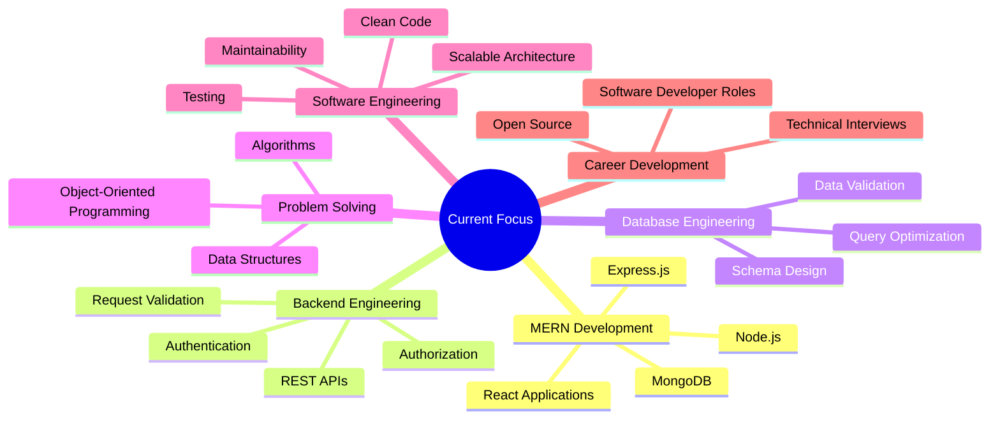

---

## Career Roadmap

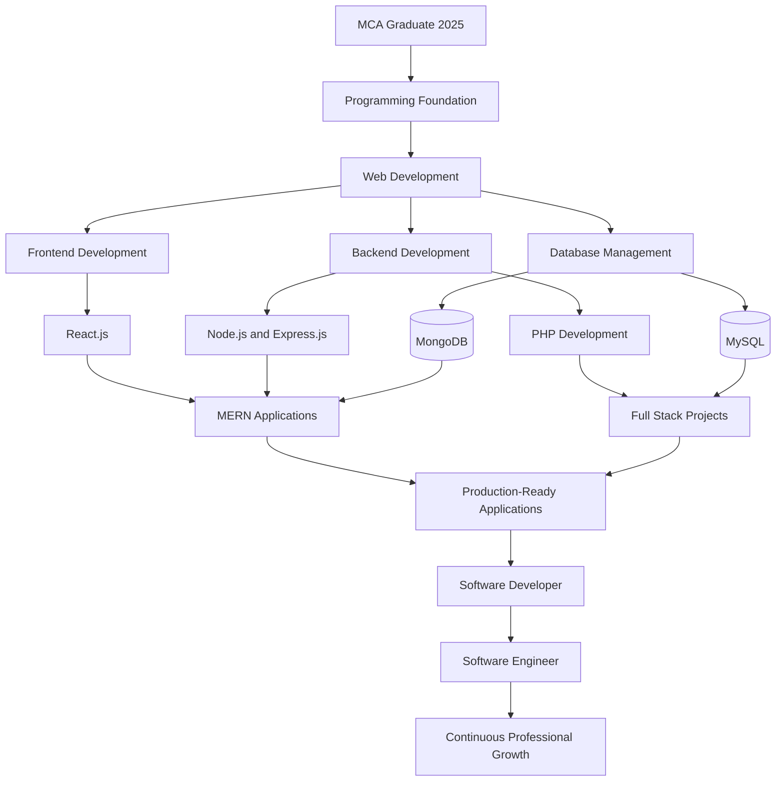

---

## Git Development Workflow

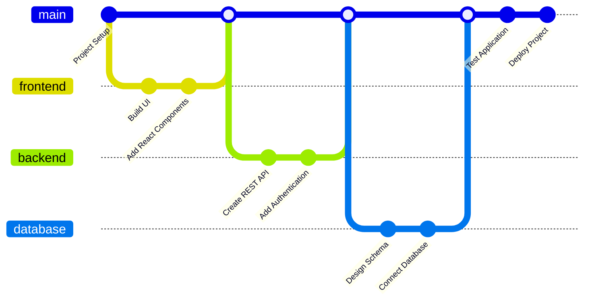

---

## GitHub Profile Statistics

<div align="center">

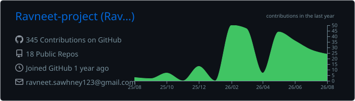

</div>

<br>

<div align="center">

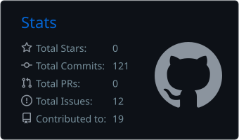

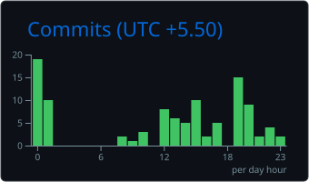

</div>

<br>

<div align="center">

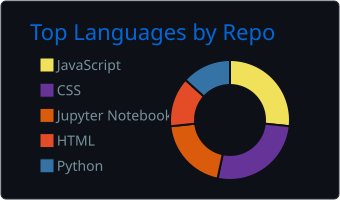

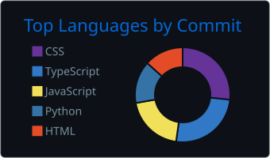

</div>

---

## Contribution Streak

<div align="center">

<a href="https://git.io/streak-stats">
  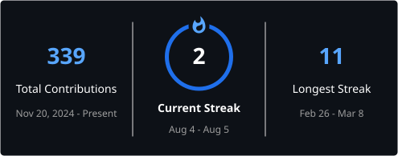
</a>

</div>

---

## Contribution Activity

<div align="center">

<a href="https://github.com/Ashutosh00710/github-readme-activity-graph">
  
</a>

</div>

## Developer Query

```sql
SELECT
    name,
    role,
    qualification,
    specialization,
    career_status
FROM developers
WHERE github_username = 'Ravneet-project';
```

```text
+------------------+----------------------+----------------+--------------------+---------------------------+
| Name             | Role                 | Qualification  | Specialization     | Career Status             |
+------------------+----------------------+----------------+--------------------+---------------------------+
| Ravneet Sawhney  | Full Stack Developer | MCA Graduate   | MERN Development   | Open to Opportunities     |
+------------------+----------------------+----------------+--------------------+---------------------------+
```

---

## Career Objective

To obtain a Software Developer position where I can apply my technical knowledge, contribute to meaningful projects, collaborate with experienced engineering teams and continue growing as a software engineering professional.

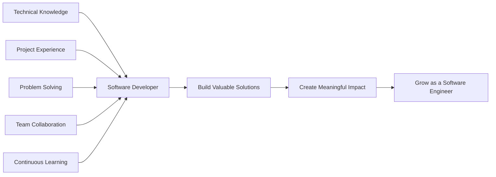

---

## Education

```text
Master of Computer Applications

Duration    : 2023 – 2025
Status      : Completed
Focus Areas : Software Development, Web Technologies,
              Databases and Problem Solving
```

---

## Connect With Me

| Platform | Profile |
|---|---|
| Portfolio | [ravneetportfolio.netlify.app](https://ravneetportfolio.netlify.app) |
| GitHub | [github.com/Ravneet-project](https://github.com/Ravneet-project) |
| LinkedIn | [Ravneet Sawhney](https://www.linkedin.com/in/ravneet-kaur-aa2b332a8/) |
| Email | [ravneet.sawhney123@gmail.com](mailto:ravneet.sawhney123@gmail.com) |

---

<div align="center">

### Learn. Build. Test. Deploy. Improve.

Great software is created through curiosity, consistency, clean architecture and continuous improvement.

</div>
