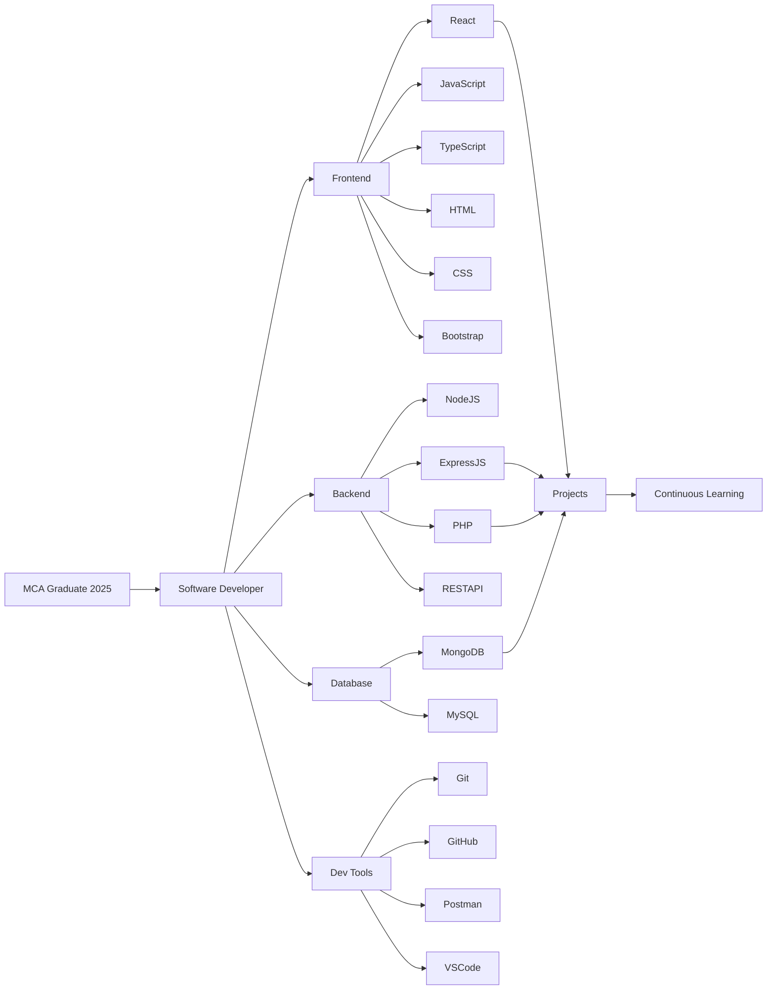
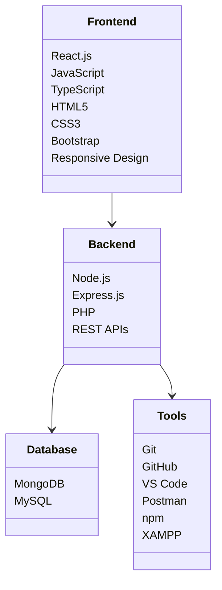
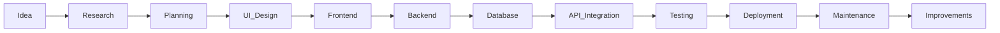
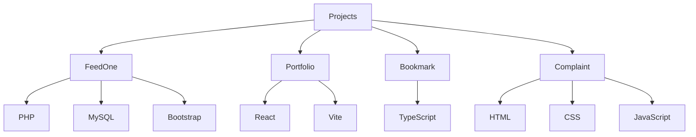
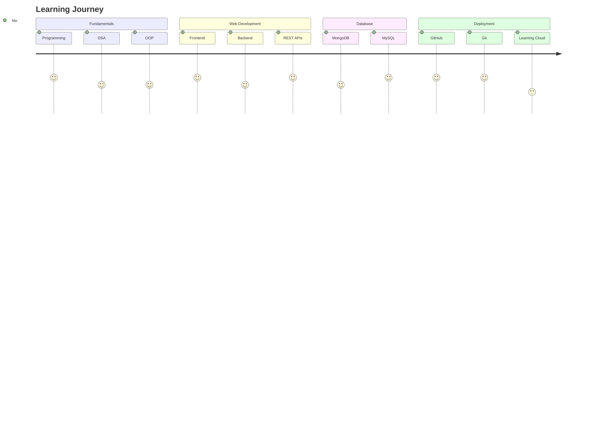
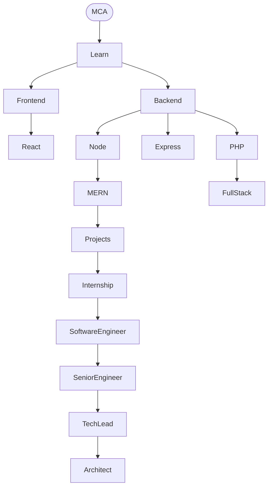
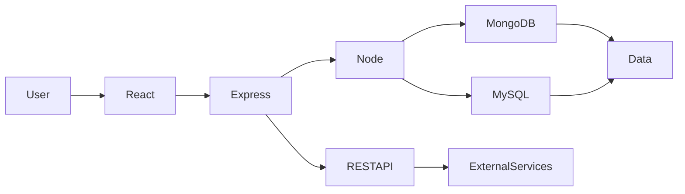
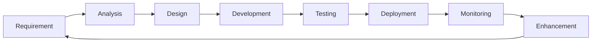
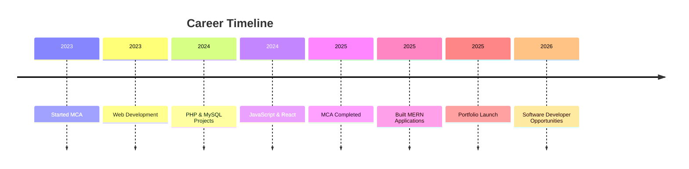
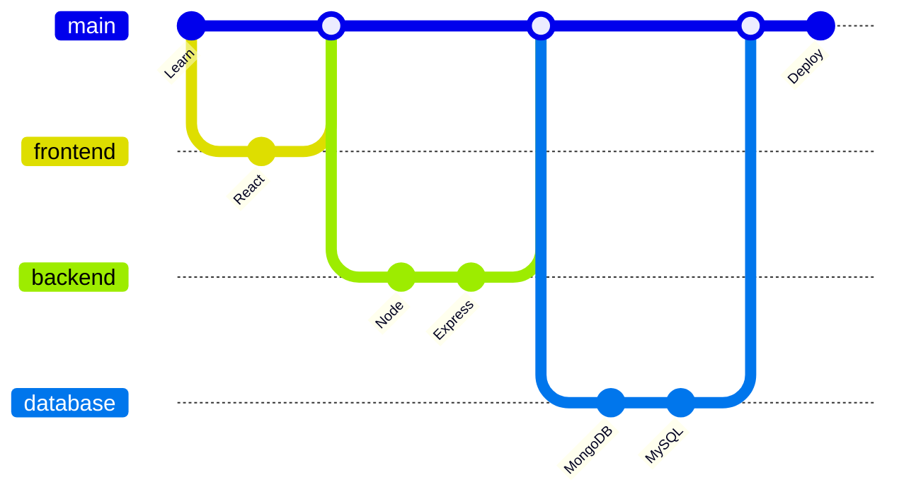

# Ravneet Sawhney

> **Full Stack Developer | MERN Stack Enthusiast | MCA Graduate (2025)**

---

## Developer Architecture



---

# About

I am a passionate Full Stack Developer who enjoys building scalable, user-centric web applications and solving real-world problems through technology. I focus on writing clean, maintainable code while continuously improving my knowledge of modern software engineering practices.

---

# Technical Skills



---

# Development Workflow



---

# Featured Projects



---

## FeedOne – Donation Management System

Donation Management Platform connecting NGOs and Donors.

**Stack**

- PHP
- MySQL
- Bootstrap
- JavaScript

---

## Smart Bookmark App

Bookmark Management Application developed using TypeScript.

**Stack**

- TypeScript
- JavaScript

---

## Personal Portfolio

Portfolio built with React & Vite.

**Live**

https://ravneetportfolio.netlify.app

---

## Academic Complaints Management System

Complaint Registration and Tracking Platform.

**Stack**

- HTML
- CSS
- JavaScript

---

# Software Engineering Journey



---

# Current Focus

```mermaid
mindmap
root((Current Focus))

MERN Stack

Backend APIs

Authentication

Database Design

Software Engineering

System Design

DSA

Open Source

Performance Optimization

Clean Architecture
```

---

# Career Roadmap



---

# Project Architecture



---

# Software Development Lifecycle



---

# Timeline



---

# GitHub Workflow



---

# Contact

| Platform | Link |
|----------|------|
| Portfolio | https://ravneetportfolio.netlify.app |
| GitHub | https://github.com/Ravneet-project |
| LinkedIn | https://www.linkedin.com/in/ravneet-kaur-aa2b332a8 |
| Email | ravneet.sawhney123@gmail.com |

---

# Career Objective

To contribute as a Software Developer by building scalable applications, writing clean and maintainable code, collaborating with engineering teams, and continuously learning modern technologies while solving meaningful real-world problems.

---

> **"Great software is built through curiosity, consistency, and continuous improvement."**
## GitHub Stats


https://github-readme-stats.vercel.app/api?username=Ravneet-project
